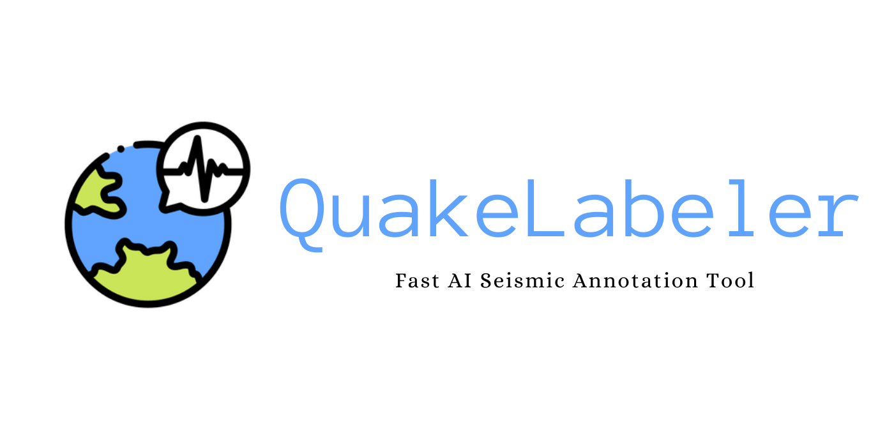

# QuakeLabeler

QuakeLabeler is a Python package to create and manage your seismic training data, processes, and visualization in a single place — so you can focus on building the next big thing.

## Introduction
QuakeLabeler (QL) is a package containing Python tools for customizing your own earthquake datasets for machine learning applications. Current functionalities include retrieving waveforms from data centers, customizing seismic samples, auto-building datasets, preprocessing and augmenting for labels, and visualizing data distribution. The code helps all levels of AI developers and seismology researchers for querying and building their own earthquake datasets and can be used through an interactive command-line interface with little knowledge of Python.

Installation, Usage, API documentation and scripts are described at
 https://maihao14.github.io/QuakeLabeler/

Author: [`Hao Mai`](https://www.uogeophysics.com/authors/mai/)(Developer and Maintainer)
 & [`Pascal Audet`](https://www.uogeophysics.com/authors/admin/) (Developer and Maintainer)

## Installation

### Conda environment

We recommend creating a custom
[conda environment](https://conda.io/docs/user-guide/tasks/manage-environments.html)
where `QuakeLabeler` can be installed along with its dependencies.

- Create a environment called `ql` and install `obspy`:

```bash
conda create -n ql python=3.8 obspy -c conda-forge
```

- Activate the newly created environment:

```bash
conda activate ql
```

### Installing from source

Download or clone the repository:
```bash
git clone https://github.com/maihao14/QuakeLabeler.git
cd QuakeLabeler
```

```bash
pip install .
```

If you work in development mode, use the `-e` argument as `pip install -e .`

## Running the scripts

Create a work folder where you will run the scripts that accompany `QuakeLabeler`. For example

```bash
mkdir ~/WorkFolder
cd WorkFolder
```

Run the main script `QuakeLabeler` with default arguments

```bash
QuakeLabeler
```

## Contributing

All constructive contributions are welcome, e.g. bug reports, discussions or suggestions for new features. You can either [open an issue on GitHub](https://github.com/maihao14/QuakeLabeler/issues) or make a pull request with your proposed changes. Before making a pull request, check if there is a corresponding issue opened and reference it in the pull request. If there isn't one, it is recommended to open one with your rationale for the change. New functionality or significant changes to the code that alter its behavior should come with corresponding tests and documentation. If you are new to contributing, you can open a work-in-progress pull request and have it iteratively reviewed. Suggestions for improvements (speed, accuracy, etc.) are also welcome.
